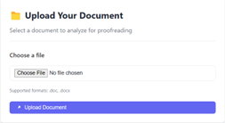
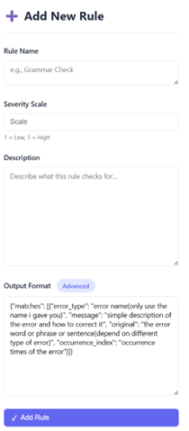
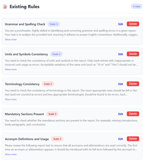
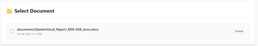
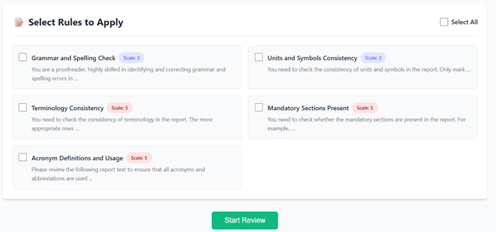
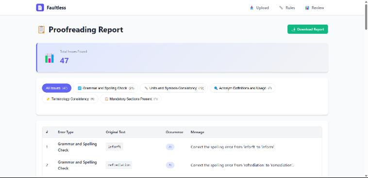

# Faultless: AI-Powered Proofreader for Engineering Reports

<!-- badges: start -->

[

[](<https://github.com/astral-sh/ruff>)
[](<https://github.com/pre-commit/pre-commit>)
[](<https://tonkintaylor-sonarqube.azurewebsites.net/dashboard?id=tonkintaylor_py-faultless-template_fc9da0e6-8d82-4eb7-bb9d-c81c6497408a>)

[](<https://tonkintaylor.atlassian.net/browse/CAPSTONE>)
<!-- badges: end -->

## Subsystem Overview

### Langfuse

Langfuse is an open-source observability and analytics tool for LLM applications. It helps developers track, evaluate, and improve LLM-based workflows by logging prompts, responses, user feedback, latency, and other metrics in real time. Langfuse supports A/B testing, trace visualization, and prompt performance comparison—making it ideal for debugging and optimizing prompt engineering pipelines. Ensure the following environment variables are set in your `.env` file:

- `LANGFUSE_SECRET_KEY`
- `LANGFUSE_PUBLIC_KEY`
- `GOOGLE_API_KEY`

Additionally, while the default LLM configuration in `llm.yml` can be modified, we recommend keeping it unchanged during development as Google provides free API calls to a robust LLM model.

## Description

### Situation
Ensuring the accuracy and compliance of engineering reports is crucial for maintaining safe, sustainable infrastructure across Aotearoa. These reports guide the development and upkeep of buildings, roads, bridges, and tunnels, directly impacting communities and the environment.

Currently, senior technical engineers manually review reports for clarity, compliance with ISO standards, and structural soundness. However, this process is slow and depends on a small pool of highly experienced experts. By streamlining reviews with AI-powered pre-checks, we can accelerate infrastructure projects, reduce bottlenecks, and allow senior engineers to focus on higher-level decisions that shape resilient, future-ready communities.

### Problem
- The bottleneck in report processing arises because experienced engineers are in short supply.
- Reviews involve multiple iterations, often requiring revisions and feedback loops.
- Reviewers focus on structural clarity, adherence to standards, and technical accuracy, which could be partially automated to reduce their workload.
- Current manual review processes are inefficient and inconsistent.

### Opportunities
- Implement an automated report review system to check for clarity, structure, and compliance before senior engineers conduct final reviews.
- Use a rule-based approach, similar to [software linters](https://docs.astral.sh/ruff/linter/), to flag issues and provide suggestions before human intervention.

### Solution
- **Automated Report Review System**: Develop an AI-driven tool to review reports before they reach senior engineers, identifying common issues and improving efficiency.
- **Structured Review Process**: Implement a system where reports are annotated with suggested changes in a Word document, enabling engineers to accept or reject recommendations.
- **Version Control & Metrics**: Track report quality over time, similar to version control in coding, to monitor improvements or recurring issues.

## System Design

### During Development
- Sequence Diagram for developing, testing, and storing prompts.

### During Deployment
- Sequence Diagram of the automated Report Review System.
- Context Diagram of the automated Report Review System.

### Definitions
- **Faultless**: The name of the **Automated Report Review System**.
- **Laptop**: The user's device, responsible for **uploading documents for review** and **downloading the reviewed document** after processing is complete.
- **Integration Hub**: The **central orchestrator** that manages document processing, coordinating interactions between all subsystems, storing analysis results, and ensuring smooth data flow.
- **Rule Engine**: Processes documents by **applying validation rules** in the form of prompts fetched from the **Prompt Management System (PMS)** and sending them to **AI Agents** for analysis.
- **Prompt Management System (PMS)**: A system responsible for **storing and managing prompts (rules)** used by the **Rule Engine** to guide AI-based document analysis.
- **AI Agents**: AI-powered components that **evaluate documents based on provided prompts**, performing tasks such as language checks, structural validation, and compliance assessments, and returning structured results.
- **Database**: Stores **document analysis results**, enabling data persistence for later retrieval, audits, or additional processing.
- **Document Server**: The system responsible for **modifying the document**, adding **comments, annotations, and tracked changes** based on analysis results before returning it for review.

## Development Strategy

Doing the right thing for the business right now > Doing the optimal thing

First make it work, then make it right, and, finally, make it fast. (In that order!)

1. **Make It Work [correctly]:** First crank out code that handles one common case.
2. **Make it Right**: Fix all salient special cases, error handling, etc. so all tests pass.
3. **Make it [become] Fast [later]**: Find and eliminate waste in the process. Some assumptions from the start will have been incorrect. Remove unnecessary business logic. Included in this step is to improve code for better performance, especially if speed is a requirement.

## Getting Started on Development

### Installing the Python environment and Configuring VS Code

Run the following command in Windows Powershell to configure the environment and
your VS Code settings (your current directory should be the root of the repo):

```Powershell
./tasks/dev_sync.ps1
```

### Starting Django locally

Run the following commands in Windows Commandline to start django:

```bash
cd src/faultless/mysite
python manage.py runserver
```

## Other Development Tasks

### Adding a dependency (or regenerating the requirements files.)

Add a lowercase name of the package to the [project].dependencies section of the
`pyproject.toml` file. You will then need to re-generate the requirements files and
install the package via:

```Powershell
./tasks/dev_sync.ps1
```

### Releasing a package version

Run the following command in Windows Powershell to release a new version of the package:

```Powershell
./tasks/release.ps1
```

The branch will be automatically created and pushed to BitBucket, ready for a PR to be
created.

## User Experience Design

### Feedback System
FAULTLESS is designed to provide clear, actionable feedback while maintaining a clean and focused user experience. The system implements several key features to ensure effective communication:

- **Upload Confirmation**: Users receive immediate visual confirmation when a file is successfully uploaded
- **Progress Tracking**: A loading indicator shows the document analysis progress
- **Error Highlighting**: Different colors indicate error severity in the document:
  - Green: Minor issues
  - Yellow: Major issues
  - Red: Critical issues

### Quality Scoring System
Documents are evaluated using a comprehensive scoring system:

| Error Level | Points | Examples |
|------------|--------|----------|
| Minor | 1 point | Formatting inconsistencies, style suggestions |
| Major | 2 points | Grammar errors, unclear phrasing |
| Critical | 5 points | Technical inaccuracies, compliance violations |

The final document score is calculated as:
```
Score = 100 - (0.5 * Total Error Points)
```

Quality levels are mapped as follows:
- Excellent: 90-100
- Good: 80-89
- Average: 70-79
- Poor: <70

### Smart Comment Management
To maintain clarity and prevent information overload:
- Duplicate errors are consolidated into a single comment
- Each unique issue is reported only once, even if it appears multiple times
- Comments are organized by severity level for easy prioritization

This approach ensures that:
- Users aren't overwhelmed by repetitive feedback
- Critical issues stand out clearly
- The review process remains efficient and focused

## Python Scripts Overview

| Script Name | Purpose |
|------------|---------|
| manage.py | Django's command-line utility for administrative tasks and project management |
| settings.py | Core Django settings and configuration for the project |
| urls.py | Main URL configuration and routing for the project |
| wsgi.py | WSGI configuration for web server deployment |
| asgi.py | ASGI configuration for asynchronous web server deployment |
| views.py | Contains view functions handling HTTP requests and business logic |
| models.py | Defines database models for Documents, Rules, and Traces |
| urls.py | URL routing configuration for the faultless application |
| forms.py | Form definitions for document and rule management |
| admin.py | Django admin interface configuration |
| apps.py | Application configuration for the faultless app |
| config.py | Configuration utilities and helper functions |
| prompt.py | Handles prompt generation and processing |
| summary.py | Manages document summarization functionality |
| llm.py | Integrates Langfuse with LangChain using Google Gemini for text analysis |
| rules.py | Handles document annotation and comment insertion based on AI analysis |
| upload_file.py | Manages document upload and text extraction from Word files |
| utils.py | Utility functions for document processing and warning removal |

## How to Use FAULTLESS

### 1. Getting Started 🚀

#### Environment Setup
```powershell
# Run in Windows PowerShell (from repository root)
./tasks/dev_sync.ps1
```

#### Launch Application
```bash
# Run in Windows Command Line
cd src/faultless/mysite
python manage.py runserver
```

#### Access Web Interface
Open your browser and navigate to:
> http://127.0.0.1:8000/

---

### 2. Document Management 📄

#### Uploading Documents
<div align="center">
  
  <p><em>Document Upload Interface</em></p>
</div>

**Steps:**
1. Click "Choose File" button
2. Select your document (.doc or .docx format)
3. Wait for the confirmation message

---

### 3. Rule Management ⚙️

#### Creating New Rules
<div align="center">
  
  <p><em>Rule Creation Interface</em></p>
</div>

**Rule Configuration Parameters:**
| Parameter | Description | Example |
|-----------|-------------|---------|
| Rule Name | Clear identifier | "Terminology Consistency" |
| Severity Scale | Importance (1-5) | 3 (Major) |
| Description | Detection criteria | "Check for consistent technical terms" |
| Output Format | JSON structure | Customizable error locations |

#### Managing Existing Rules
<div align="center">
  
  <p><em>Rules Management Dashboard</em></p>
</div>

**Available Actions:**
- 👀 View all rules
- ✏️ Edit rule parameters
- 🗑️ Remove unnecessary rules

---

### 4. Document Review Process 🔍

#### Step 1: Select Document
<div align="center">
  
  <p><em>Document Selection Interface</em></p>
</div>

#### Step 2: Configure Review
<div align="center">
  
  <p><em>Rule Selection Interface</em></p>
</div>

**Configuration:**
- ✅ Select applicable rules
- 🚀 Click "Review" to begin analysis

#### Step 3: Review Results
<div align="center">
  
  <p><em>Review Results Dashboard</em></p>
</div>

**Output Features:**
- 📊 Comprehensive error overview
- 📝 Annotated document with:
  - Inline comments
  - Color-coded error highlighting
  - Detailed summary report
- ⬇️ Download option for reviewed document

---


